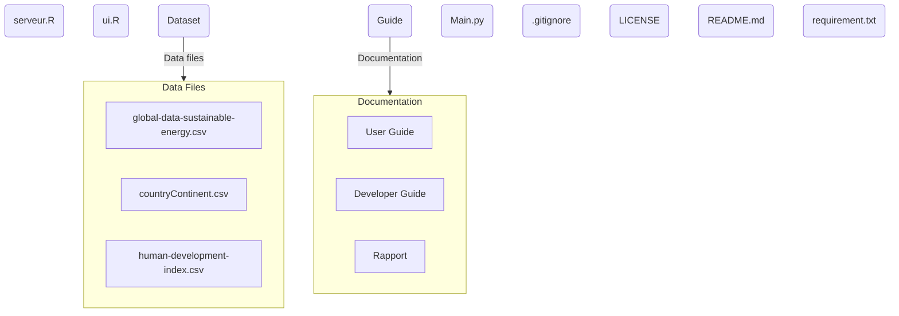
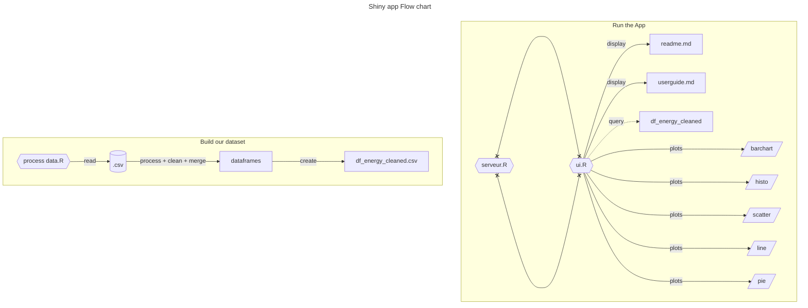

# 
Developer Guide :
 

The purpose is to allows you to understand the architecture of the code and modify or extend it.

--- 

## Project structure : 
### Mermaid magic: 

### Multi-pages :
This multi-pages repository is set like the [official documentation](https://shiny.posit.co/r/gallery/application-layout/navbar-example/) guidelines.

Here were going through each folder and give a little detail of what is it.
- The dataset folder contain each dataset csv and the ipython notebook associated to the data cleaning and aggregation.
- The guide folder contain some markdown files
- The **serveur.R** is the entry point of the project. It is the luncher of the Shiny app.
- The `.gitignore` is the file which indicate the file and folder to do not commit and push on the git repo (set by GitHub and modify by us)
- The `README.md` fie is the landing page on GitHub. contain a brief description of the project.
- The `requirement.txt` is the list of all necessary dependency with the version.
- The `.Rhsitory`, `.Rproj` et `.Rdata` are needed file (init by RStudio)

